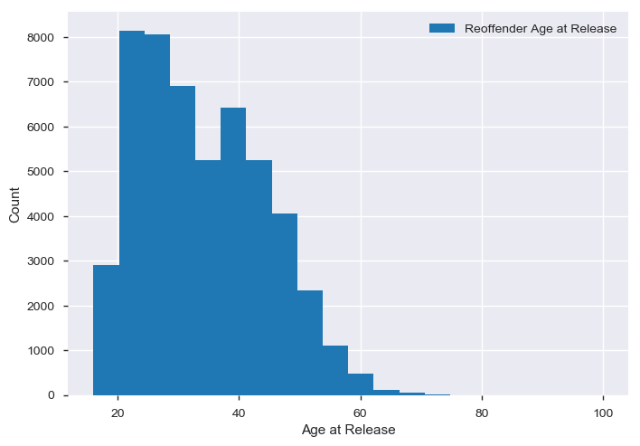
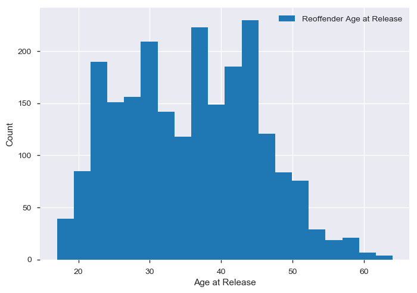
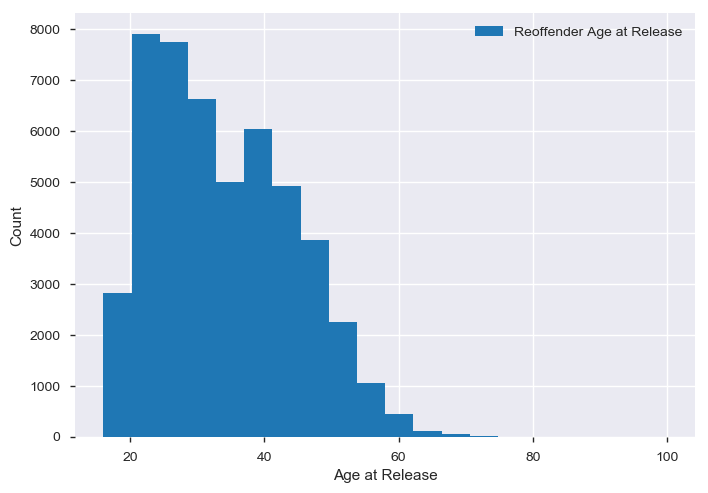

### Introduction
Exploring and doing a simple exploratory analysis of a dataset is a crucial skill for anyone aspiring to work with data, which is nearly everyone nowadays! Understanding your data is a critical first step to deriving meaning and producing results. With minimal coding background required, I will outline a way for you to analyze and explore your data. Please visit my Github and clone [this repository](https://github.com/steven-purcell/data-analytics-ny-recidivism) for the full notebook. A link to a Github tutorial is provided at the end of this entry if you need help getting started.

### Getting Started
I use [Jupyter Notebook](https://jupyter.org/), [pandas](https://pandas.pydata.org/), and [matplotlib](https://matplotlib.org/) for this example. New York provides a [free dataset](https://data.ny.gov/Public-Safety/Recidivism-Beginning-2008/y7pw-wrny) that contains information starting in 2008 regarding prisoner release and reoffender status. The dataset is easy to work with, containing 5 columns and approximately 124,000 records. There are no null or NaN values to deal with as it is a clean and processed data set which makes this a painless process.

### The Code Walkthrough
Python requires that any packages be declared and imported. This typically happens at the top of your code. Additionally, Jupyter can be forced to show the plots we create by including `%matplotlib inline`. If you are new to Python, pay special attention to the sections of code where these packages are called by looking for `pd`, `plt`, and `pandas_profiling`. 

```python
import pandas as pd
import pandas_profiling
import matplotlib.pyplot as plt
%matplotlib inline
```

Load the .csv to a pandas DataFrame using `pandas.read_csv()`. A DataFrame is a 2-dimensional labeled data structure with a column format, similar to a spreadsheet.

I initially use a `data.info()` call to display some information about the data contained in the file. This initial information provides column names, a row count, a flag for present null values, and the datatype inferred by pandas. This is useful for validating the data and alerting us if any processing will be necessary to handle null values or create dummy variables. We can see from this information that our dataset is in a post-processed state.

```python
data = pd.read_csv(".\\Recidivism__Beginning_2008.csv")

data.info()
```

    <class 'pandas.core.frame.DataFrame'>
    RangeIndex: 123588 entries, 0 to 123587
    Data columns (total 5 columns):
    Release Year            123588 non-null int64
    County of Indictment    123588 non-null object
    Gender                  123588 non-null object
    Age at Release          123588 non-null int64
    Return Status           123588 non-null object
    dtypes: int64(2), object(3)
    memory usage: 4.7+ MB
    
Next, `data.describe()` provides some statistical information about the data. A mean, standard deviation, minimum value, and maximum value are returned, among other important information.

```python
data.describe()
```

            Release Year  Age at Release
    count  123588.000000   123588.000000
    mean     2009.932097       35.312029
    std         1.419576       10.798967
    min      2008.000000       16.000000
    25%      2009.000000       26.000000
    50%      2010.000000       34.000000
    75%      2011.000000       43.000000
    max      2012.000000      100.000000

A very powerful tool for initial data analytics is Pandas Profiling. A Pandas Profile provides powerful visual statistical information about a DataFrame. Once pandas_profiling is imported, it is as easy as `pandas_profiling.ProfileReport(data)` which returns a beautiful interactive report which is available in the Jupyter Notebook in the provided repository.

Finally, the data needs to be parsed to find some interesting information. In this analysis, I've decided to use histograms to view the data for reoffenders as a whole, male reoffenders, and female reoffenders by age.

### Reoffenders
Below the DataFrame is parsed such that only reoffenders remain. A count is taken to see how many of the approximately 124,000 individuals were reoffenders. A histogram is a great way to visualize the distribution of a dataset in 2-dimensions. The age of reoffenders is skewed right, meaning that fewer data points are found to the right of the graph. It would appear that offenders that are released at younger ages tend to reoffend at a higher rate.

```python
reoffender_data = data[data['Return Status']!='Not Returned']
print(reoffender_data.count())
plt.hist(reoffender_data['Age at Release'], label=['Reoffender Age at Release'], bins=20)
plt.xlabel('Age at Release')
plt.ylabel('Count')
plt.legend(loc='upper right')
plt.show()
```

    Release Year            51111
    County of Indictment    51111
    Gender                  51111
    Age at Release          51111
    Return Status           51111
    dtype: int64
    




### Female Reoffenders

Let's turn our focus to female reoffenders. The first line of the following code will select female only reoffenders and provide a count. We can see that female offend and reoffend at a much lower rate than males. The histogram tells a different story when plotted. Age is a less reliable indicator of a reoffender with women in this sample.

```python
female_only_reoffender_data = data[(data['Gender']=='FEMALE') & (data['Return Status']!='Not Returned')]
print(female_only_reoffender_data.count())
plt.hist(female_only_reoffender_data['Age at Release'], label=['Reoffender Age at Release'], bins=20)
plt.xlabel('Age at Release')
plt.ylabel('Count')
plt.legend(loc='upper right')
plt.show()
```

    Release Year            2238
    County of Indictment    2238
    Gender                  2238
    Age at Release          2238
    Return Status           2238
    dtype: int64
    




### Male Reoffenders

Male reoffenders really dominate the overall count in this dataset. After selecting male reoffenders from our dataset, we again create a histogram and see that it mostly resembles the original histogram, since males dominate the sample we should not be surprised. Again the data is right skewed with younger males seeming to be the most likely reoffenders. Keep in mind that the age in this dataset is 'Age at Release' which indicates that these males were young offenders that likely did short amounts of time and then reoffended, where the data points to the right of the histogram may have either been older minor offenders or were young when they were originally incarcerated and spent a longer time in incarceration. The severity of the offense and the sentence time would be helful to derive more meaning from this dataset.

```python
male_only_reoffender_data = data[(data['Gender']=='MALE') & (data['Return Status']!='Not Returned')]
print(male_only_reoffender_data.count())
plt.hist(male_only_reoffender_data['Age at Release'], label=['Reoffender Age at Release'], bins=20)
plt.xlabel('Age at Release')
plt.ylabel('Count')
plt.legend(loc='upper right')
plt.show()
```

    Release Year            48873
    County of Indictment    48873
    Gender                  48873
    Age at Release          48873
    Return Status           48873
    dtype: int64
    





### Conclusion

Please take the time to clone or fork this [Github repository](https://github.com/steven-purcell/data-analytics-ny-recidivism) and dig in to see how the code works. Follow the links throughout to find helpful information and tutorials to assist you in working with the data. Once the repository is cloned to your local environment you can run it and even make your own changes. This type of simple analysis is the bread and butter of any data work. If you are unfamiliar with Github, try a [simple tutorial to get started](https://guides.github.com/activities/hello-world/). A small but well-executed set of Python commands can really tell an impressive story from a relatively mundane dataset.